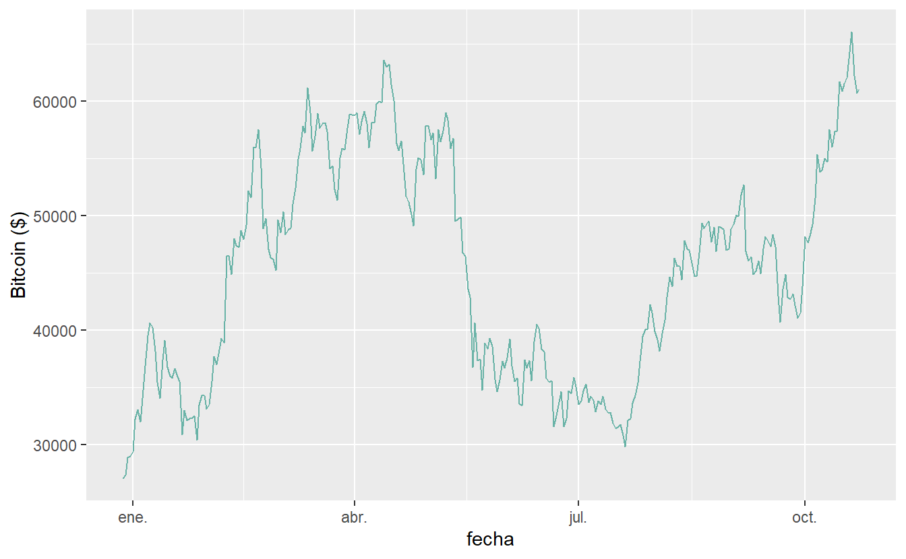

Bitcoin es una moneda digital creada en el 2008 por una entidad bajo el pseudonimo de Satoshi Nakamoto, que sirve de intercambio como otra moneda física. La característica mas resaltante es que es una moneda descentralizada, es decir que no existe una autoridad o ente de control que sea responsable de su emisión y registro de sus movimientos y no sufre de inflación, ya que existe un numero limite de monedas. La tecnología que usa para la transferencia o movimientos de la moneda digital es la cadena de bloques o Blockchain, la cual en terminos simple lleva un registro de cada movimiento o etiqueta, y se copia en cada cadena de bloques de manera que todos los usuarios de la cadena deben tener la misma información para validar la transacción, lo que hace muy dificil la falsificación. Si quieres saber mas te dejo información [aquí](https://es.wikipedia.org/wiki/Bitcoin)

# **Leer información desde (CSV)**

<pre class='chroma'><code class='language-r' data-lang='r'><a href='https://rdrr.io/r/base/library.html'>library</a>(<a href='https://tidyverse.tidyverse.org'>tidyverse</a>)
<a href='https://rdrr.io/r/base/library.html'>library</a>(<a href='https://github.com/braverock/PerformanceAnalytics'>PerformanceAnalytics</a>)

btc &lt;- <a href='https://rdrr.io/r/utils/read.table.html'>read.csv</a>("dailyDataBTC-USD.csv", stringsAsFactors = F, header = T)
btc &lt;- btc <a href='https://magrittr.tidyverse.org/reference/pipe.html'>%&gt;%</a> <a href='https://dplyr.tidyverse.org/reference/mutate.html'>mutate</a>(fecha = <a href='https://rdrr.io/r/base/as.Date.html'>as.Date</a>(<a href='https://rdrr.io/r/base/as.POSIXlt.html'>as.POSIXct</a>(unix, origin = "1970-01-01"))) <a href='https://magrittr.tidyverse.org/reference/pipe.html'>%&gt;%</a> <a href='https://dplyr.tidyverse.org/reference/arrange.html'>arrange</a>(fecha)
<a href='https://rdrr.io/r/base/Extremes.html'>min</a>(btc$fecha)
#&gt; [1] "2020-12-28"
<a href='https://rdrr.io/r/base/Extremes.html'>max</a>(btc$fecha)
#&gt; [1] "2021-10-23"
<a href='https://rdrr.io/r/base/Extremes.html'>max</a>(btc$fecha)-<a href='https://rdrr.io/r/base/Extremes.html'>min</a>(btc$fecha)
#&gt; Time difference of 299 days</code></pre>

Para fines practicos usaremos este [archivo](https://www.dmorialva.com/post/describiendo-btc/dailyDataBTC-USD.csv) para el análisis. Pero te dejaré un link para que puedas extraer informacion desde la una API.

Como un primer análisis, mostraremos la serie temporal del bitcoin con su precio ajustado al cierre diario.

<pre class='chroma'><code class='language-r' data-lang='r'><a href='https://rdrr.io/r/base/library.html'>library</a>(<a href='https://ggplot2.tidyverse.org'>ggplot2</a>)

# Convertimos el dataframe en un objeto xts
btc_graph &lt;- btc <a href='https://magrittr.tidyverse.org/reference/pipe.html'>%&gt;%</a>
            <a href='https://ggplot2.tidyverse.org/reference/ggplot.html'>ggplot</a>( <a href='https://ggplot2.tidyverse.org/reference/aes.html'>aes</a>(x=fecha, y=close)) +
            <a href='https://ggplot2.tidyverse.org/reference/geom_path.html'>geom_line</a>(color="#69b3a5") +
            <a href='https://ggplot2.tidyverse.org/reference/labs.html'>ylab</a>("Bitcoin ($)") 
btc_graph 
</code></pre>

A partir del grafico, solo podemos observar que el precio en este lapso de tiempo, formo un soporte alrededor de los 30 mil y un maximo de 65 mil. Ahora mencionaremos 2 conceptos básicos para empezar a analizar el bitcoin y cualquier otro instrumento bursátil.

# **Rendimiento o Retorno Simple y continuo**

Al iniciar a estudiar los modelos de finanzas cuantitativas básicos, como obtener el riesgo historico de un activo, o al intentar aplicar el modelo de Markowitz para un portafolio de inversión, necesitamos la variable retorno del activo. Para esto existen modelos que usan el rendimiento simple o aritmetico y otros el compuesto o logaritmico.쮺uando usar uno u otro?. 쯉on iguales o diferentes?. Intentaré poner sobre la mesa las ventajas y los usos de cada uno.

## **Aritmetico o Simple**

Se calcula como la variacion porcentual de 2 precios: $$Rs = \frac{P_t - P_{t-1}}{P_{t-1}}$$ Esta forma del cálculo de los retornos hace que se encuentren normalizados, es decir son comparables con otra serie de retornos de otro activo a pesar que las magnitudes de sus precios sean considerablemente diferentes. Esto tambien debe usarse para el cálculo de la matriz de covarianzas en nuestros análisis, a fin de poder diversificar una cartera con el modelo de Markowitz. La rentabilidad de un periodo de tiempo es la media geometrica de las rentabilidades que lo componen. $$R_{acumulada} = \sqrt[N]{\prod_{i=1}^{N}Rs_i}$$ Mas adelante este será un punto en contra para el retorno simple.

## **Logaritmico o Continuo**

Se calcula como la diferencia de los precios en logaritmos naturales: $$Rc = \ln{(\frac{P_t}{P_{t-1}})}$$ De la formula de arriba es fácil deducir la siguiente relación: $$Rc = \ln{(1+Rs)}$$ La rentabilidad de un periodo de tiempo es la sumatoria de las rentabilidades que lo componen, gracias a las propiedades de los logaritmos. $$R_{acumulada} = \sum_{i=1}^{N}Rc_i = \sum_{i=1}^{N}ln{(1+Rs_i)}$$

En muchos modelos se asumen que la distribución de los retornos de un activo siguen una distribucion normal, segun esto los retornos podrian ir hasta valores de -$\infty$ y sabemos que la pérdida máxima es del 100% de la inversión. Otro problema de asumir esta distribucion es que constantemente estará a prueba la curtosis, que da la forma a las colas de la distribucion que en muchos casos seran mas pesadas que una normal.

De aqui se desprende que tanto el retorno simple y el continuo se distribuyen como una normal. En particual, al ser el retorno continuo el logaritmo de 1 + Rs, se dice que 1 + Rs se distribuye como una lognormal. Por los teoremas de convolución, para el caso del retorno simple, el retorno acumulado es la productoria de variables normales, cuyo resultado no se distribuye como una normal, mientras que en el caso continuo, el retorno acumulado es hallado como la suma de variables normal cuyo resultado es una normal, mostrandose asi una gran ventaja sobre el simple.

# **Histograma de retornos BTC**

Ahora vamos a empezar con un pequeño análisis de cómo se comportan los rendimientos logaritmicos diarios del BTC en el periodo de tiempo en estudio. Una manera simple de observarlo sería construir un histograma y obtener medidas que nos pueden ser muy informativas:

<pre class='chroma'><code class='language-r' data-lang='r'>#&gt;   crypto Ret_Esperado Riesgo_sd
#&gt; 1    BTC         0.27      4.43
#&gt;    Metrica Valor_pct
#&gt; 1  VaR 99%    -11.88
#&gt; 2  VaR 95%     -6.46
#&gt; 3 TVaR 99%    -14.38
#&gt; 4 TVaR 95%     -9.80</code></pre>

Pasaremos a explicar brevemente cada métrica descriptiva y para ello vamos a suponer que queremos tomar una posicion en el mercado Spot, es decir comprar, mantener y luego vender.

**Probabilidad de ganar** $$P(Rc > 0) = \frac{Cuenta\;Días\;Positivos}{Total\;Días}$$ En el periodo analizado, en un dia cualquiera existe esta probabilidad de que sea un dia con un retorno positivo (52.84%).

**Retorno Promedio** $$\overline{Rc} = \frac{\sum_{i=1}^{N}{Rc_i}}{N}$$ No indica cual fue la rentabilidad diaria promedio en el periodo (0.27%).

**Retorno Positivo** $$\overline{Rc+} = \frac{\sum_{i=1}^{N+}{Rc_i+}}{Cuenta\;Días\;Positivos}$$ Nos informa, que si el dia en el que hemos abierto una posicion de compra (posición Long), y éste resulta en un movimento al alza, el retorno promedio esperado seria de 3.38%

**Retorno Negativo** $$\overline{Rc-} = \frac{\sum_{i=1}^{N-}{Rc_i-}}{Cuenta\;Días\;Negativos}$$ Al contrario del apartado anterior, si el dia resulta en un movimiento a la baja, esperamos tener un retorno promedio de -3.21%

**Volatilidad o Riesgo** $$\widehat {\sigma_R} = \sqrt\frac{\sum_{i=1}^{N}{(Rc_i-\overline{Rc})^{2}}}{N-1}$$ Esta medida de dispersión nos indica en cuanto se puede desviar la retantabilidad promedio esperada tanto positiva como negativamente, esto se le conoce como la volatilidad, que en este caso es de 4.43%. Piense en esta medida tambien como el riesgo o incertidumbre debido a los movimientos del mercado.

**Valor en Riesgo o VaR No Paramétrico** $$VaR_{q} = quantil(1-q) = F_R^{-1}(1-q)  \;\;para\;q \in\;<0,1>$$ Otra medida de riesgo adicional a la de la volatilidad es la del VaR. Si el inversor esta interesado en saber cual es la máxima pérdida en un periodo con un nivel de confianza asociado, esta es la del VaR. Por ejemplo, en el caso en estudio el VaR(95%) es -6.46%, que indica

### Te parece útil? Considera compartirlo 🙌

