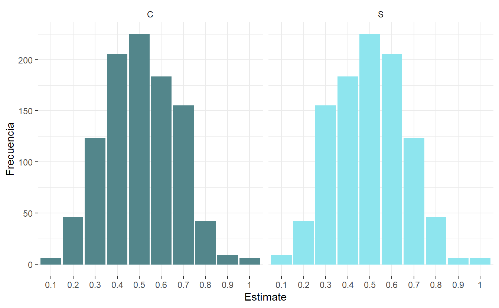

# Definición de probabilidad

Como vimos en el post de [Explorando Probabilidades](https://www.dmorialva.com/post/explorando-informacion/), la probabilidad se define como la cuantificación de la ocurrencia de un evento en un experimento. Para ello, debemos conocer el **espacio muestral**, que es el conjunto de todos los posibles resultados. Empecemos con el lanzamiento de una moneda. En este experimento, el espacio muestral es de Cara (c) o Sello (s).

<pre class='chroma'><code class='language-r' data-lang='r'># Lanzamiento de una moneda
<a href='https://rdrr.io/r/base/sample.html'>sample</a>(x=<a href='https://rdrr.io/r/base/c.html'>c</a>("c","s"), size = 1)
#&gt; [1] "c"
# La probabilidad de este evento es 1/2</code></pre>

Creo que nos hes fácil entender, que un lanzamiento no influye en el resultado del siguiente, esta caracteristica hace que los eventos sea independientes.

Vamos hacer el siguiente experimento: lanzaremos una moneda 100 veces, y comprobaremos las probabilidades. ¿Esperas tener 50 caras y 50 sellos exactamente?

Como es de esperar, no obtenemos 50 caras y 50 sellos. Si repitieramos este experimento, podemos tener muchas combinaciones posibles, por ejemplo P(c) = 0.2 y P(s) = 0.8 Es decir, si en un lanzamieno obtenemos cara, no es de esperar que en siguiente sea sello, ya que los eventos son independientes. Vamos a ejecutar 1000 veces este experimento y graficar los histogramas.

Como vemos, el resultado no siempre es tener 50/50, es posible tener 10/90 o 70/30, pero entonces ¿No era una moneda justa?. ¿Por qué no obtenemos siempre 50/50?. La respuesta es que nosotros esperamos que el evento de 50/50 sea el mas probable y cuya esperanza sea en el infinito de 0.5. Para estas 1000 simulaciones observamos qué el valor más probable:

<pre class='chroma'><code class='language-r' data-lang='r'>
probabilityDistribution %&gt;% 
  select(Estimate, Frecuencia, Resultado) %&gt;% 
  group_by(Resultado) %&gt;% 
  summarise(mode = Estimate[<a href='https://rdrr.io/r/base/which.min.html'>which.max</a>(Frecuencia)])
#&gt; # A tibble: 2 × 2
#&gt;   Resultado mode 
#&gt;   &lt;chr&gt;     &lt;chr&gt;
#&gt; 1 C         0.5  
#&gt; 2 S         0.5</code></pre>

Exactamente, es el escenario donde se da el 50/50, el mas probable (mayor frecuencia). ¿Y cuál es la medida promedio?

<pre class='chroma'><code class='language-r' data-lang='r'>probabilityDistribution %&gt;% 
  select(Estimate, Frecuencia, Resultado) %&gt;% 
  group_by(Resultado) %&gt;% 
  summarise(mean = <a href='https://rdrr.io/r/base/sum.html'>sum</a>(<a href='https://rdrr.io/r/base/numeric.html'>as.numeric</a>(Estimate)*Frecuencia)/<a href='https://rdrr.io/r/base/sum.html'>sum</a>(Frecuencia))
#&gt; # A tibble: 2 × 2
#&gt;   Resultado  mean
#&gt;   &lt;chr&gt;     &lt;dbl&gt;
#&gt; 1 C         0.496
#&gt; 2 S         0.505</code></pre>

Conforme sigamos lanzando la moneda, la probabilidad que resulte cara en el infinito debe ser 0.5, por la definicion de [convergencia en probabilidad](https://es.wikipedia.org/wiki/Convergencia_en_probabilidad). Esto tambien se podria demostrar mediante inferencia estadistica, por ejemplo por una prueba de hipótesis, en el cual se quiere probar que el parámetro de interés resulte ser estadísticamente significativo a partir de una muestra.

### Te parece útil? Considera compartirlo 🙌

