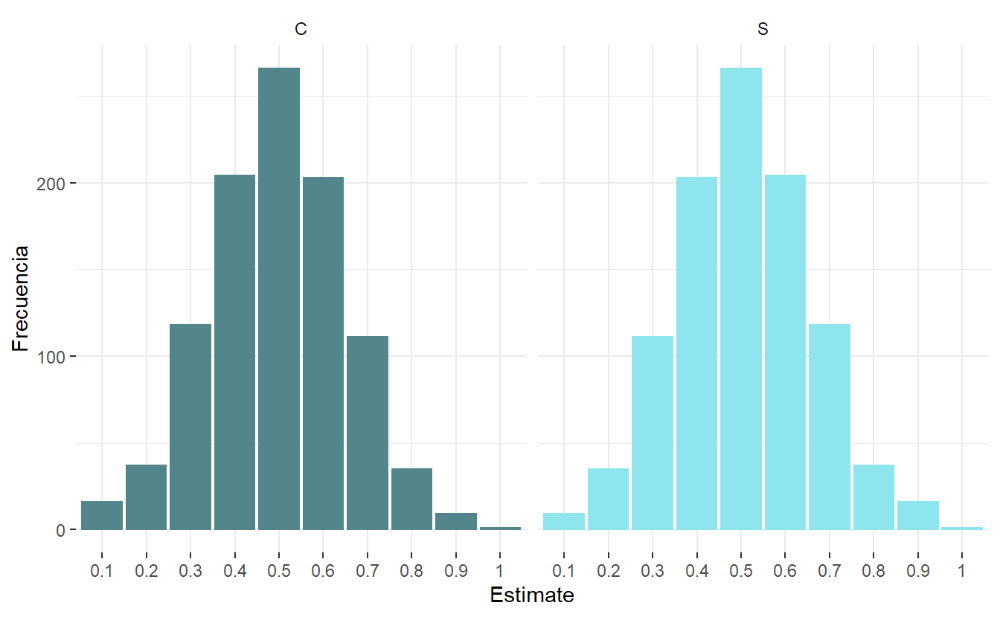

# Definición de probabilidad

Como vimos en el post de [Explorando Probabilidades](https://www.dmorialva.com/post/explorando-informacion/), la probabilidad se define como la cuantificación de la ocurrencia de un evento en un experimento. Para ello, debemos conocer el **espacio muestral**, que es el conjunto de todos los posibles resultados. Empecemos con el lanzamiento de una moneda. En este experimento, el espacio muestral es de Cara (c) o Sello (s), tambien conocido como ensayo de [Bernoulli.](https://es.wikipedia.org/wiki/Ensayo_de_Bernoulli#:~:text=En%20la%20teoría%20de%20probabilidad,en%20honor%20a%20Jakob%20Bernoulli.)

<pre class='chroma'><code class='language-r' data-lang='r'># Lanzamiento de una moneda
<a href='https://rdrr.io/r/base/sample.html'>sample</a>(x=<a href='https://rdrr.io/r/base/c.html'>c</a>("c","s"), size = 1)
#&gt; [1] "s"
# La probabilidad de este evento es 1/2</code></pre>

Es fácil entender, que un lanzamiento no influye en el resultado del siguiente, esta característica hace que los eventos sean independientes.

Vamos a realizar el siguiente experimento: simulamos el lanzamiento de una moneda 100 veces, y cuantificaremos las probabilidades. ¿Esperas tener 50 caras y 50 sellos exactamente?. Este experimento se convierte en una distribución binomial, el cual se define como "n" ensayos de Bernoulli.

Como es de esperar, no obtenemos 50 caras y 50 sellos. Si repitiéramos este experimento, podemos tener muchas combinaciones posibles, por ejemplo, P(c) = 0.2 y P(s) = 0.8 Es decir, si en un lanzamiento obtenemos cara, no es de esperar que en siguiente sea sello, ya que los eventos son independientes. Vamos a ejecutar 1000 veces este experimento y graficar los histogramas.

Tal ves la pregunta que viene a la cabeza es, ¿No era una moneda justa? ¿Por qué no obtenemos siempre 50/50? La respuesta es que en 1000 lanzamientos obtienes todas las combinaciones posibles, pero hay algo más que podríamos notar. ¿Cuál es el valor mas probable?.

<pre class='chroma'><code class='language-r' data-lang='r'>
probabilityDistribution %&gt;% 
  select(Estimate, Frecuencia, Resultado) %&gt;% 
  group_by(Resultado) %&gt;% 
  summarise(mode = Estimate[<a href='https://rdrr.io/r/base/which.min.html'>which.max</a>(Frecuencia)])
#&gt; # A tibble: 2 × 2
#&gt;   Resultado mode 
#&gt;   &lt;chr&gt;     &lt;chr&gt;
#&gt; 1 C         0.5  
#&gt; 2 S         0.5</code></pre>

Exactamente, es el escenario donde se da el 50/50, el más probable (mayor frecuencia). ¿Y cuál es la medida promedio?

<pre class='chroma'><code class='language-r' data-lang='r'>probabilityDistribution %&gt;% 
  select(Estimate, Frecuencia, Resultado) %&gt;% 
  group_by(Resultado) %&gt;% 
  summarise(mean = <a href='https://rdrr.io/r/base/sum.html'>sum</a>(<a href='https://rdrr.io/r/base/numeric.html'>as.numeric</a>(Estimate)*Frecuencia)/<a href='https://rdrr.io/r/base/sum.html'>sum</a>(Frecuencia))
#&gt; # A tibble: 2 × 2
#&gt;   Resultado  mean
#&gt;   &lt;chr&gt;     &lt;dbl&gt;
#&gt; 1 C         0.496
#&gt; 2 S         0.505</code></pre>

Conforme sigamos lanzando la moneda, la probabilidad que resulte cara en el infinito debe ser 0.5, por la definicion de [convergencia en probabilidad](https://es.wikipedia.org/wiki/Convergencia_en_probabilidad) siempre y cuando la moneda sea justa y no cargada. Esto también se podría demostrar mediante inferencia estadística, por ejemplo por una prueba de hipótesis, en el cual se quiere probar que el parámetro de interés resulte ser estadísticamente significativo a partir de una muestra.

Te dejo una razón más del porqué es importante la teoría de probabilidad. Para los casinos, que trabajan con juegos de azar que involucran las probabilidades, no les hace falta saber el resultado de cada experimento del juego de la ruleta o de un blackjack o del giro de una máquina de monedas, solamente necesitan saber que tienen probabilidades esperadas favorables a ellos, y que en promedio siempre estarán por encima que el jugador, así que no importa si el jugador saca una flor imperial, ya que es un resultado esperado.

### Te parece útil? Considera compartirlo 🙌

